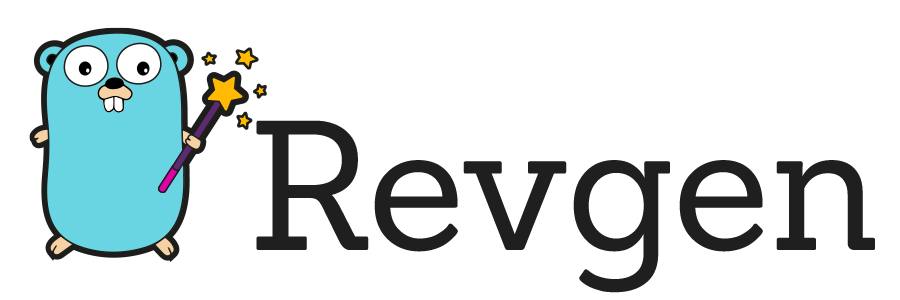

[](https://opensource.org/licenses/MIT)
[](https://goreportcard.com/report/github.com/inigolabs/revgen)
[](https://godoc.org/github.com/inigolabs/revgen)

## Speed up go:generate by auto detecting code changes.

At [Inigo](https://www.inigo.io) we generate a lot of go code. 
While our compile and build time runs in a matter of seconds thanks to the great go toolchain, running all the generators takes a few minutes on a good day. 
Running a single generator is fairly fast, but having to keep track of which generator to run gets annoying very fast.  
Revgen keeps track of all the go:generate dependencies and only runs the generators for code that has been updated. 
By running one to a handful of generators at most, the go:generate run time goes down from minutes to seconds.  
Each go:generate command is configured with a list of dependent files.
When revgen is run, it calculates the hash of all these files, compares it with the latest hash, if they differ the corresponding go:generate command is run and updates the stored hash.  
Revgen can also keep track of dependent go:generate commands and always run them in the correct order. 

Installation
------------

### Go
```shell
> go install github.com/inigolabs/revgen@latest
```

### Brew
```shell
> brew tap inigolabs/homebrew-tap
> brew install revgen
```

### Manual
Download the right pre-compiled binary for your system from the [releases page](https://github.com/inigolabs/revgen/releases) and install.

Operation
---------
```shell
> revgen init
```
The very first time, run **revgen init** to initialize and create a **.revgen.yml** config file.  
Run this command in the root go dir, the config file will be created in this directory. 
See the configuration section for more information on setting go generate file dependencies.
***  
```shell
> revgen
```
Run **revgen** anywhere inside your go workspace to call all the generators for code that has changed.  
***  
```shell
> revgen --force
```
Run **revgen --force** to run all the generators regardless of code updates. 
***
```shell
> revgen update
```
Run **revgen update** to update the config file when go::generate commands are added or removed from the code. 
***
```shell
> revgen check
```
Run **revgen check** to check that all hashes match the current state of the code.  
Can be useful in continuous integration pipelines to make sure all needed code has been generated.  
  
Configuration
-------------
Each go:generate command has a list of file dependencies which can be configured in **.revgen.yml**.
- path : the file path to the go:generate command
- gen_cmd : the go:generate command - used to distinguish between multiple go:generate commands in the same file
- gen_dep : marks a dependency on another go:generate command
- inputs : list of input files of globs that the go:generate command depends on.
- outputs : list of generated files of globs that the go:generate command generates.
***
Revgen stores the currently generated hashes in **.revgen.sum**, in general this file doesn't need to be edited. 
When in doubt, entries from .revgen.sum can be safely removed or the hash edited, they will be recomputed the next time revgen runs.  
***
Example .revgen.yml:
```yaml
auto_update: true
generators:
  generator_one_name:
    path: gql/access/access_ast/document.go
    gen_cmd: go run github.com/super/cool
    gen_dep: ""
    inputs:
      - super/cool/generator.yml
      - super/cool/*.go
    outputs:
      - super/cool/gen/generated.go
  generator_two_name:
    path: another/cool/generator.go
    gen_cmd: go run github.com/another/generator
    gen_dep: generator_one_name
    inputs:
      - another/cool/generator.yml
    outputs:
      - another/cool/gen/output.go
```
  
License
-------
- [MIT License](LICENSE)
  
Happy Coding!
-------------
